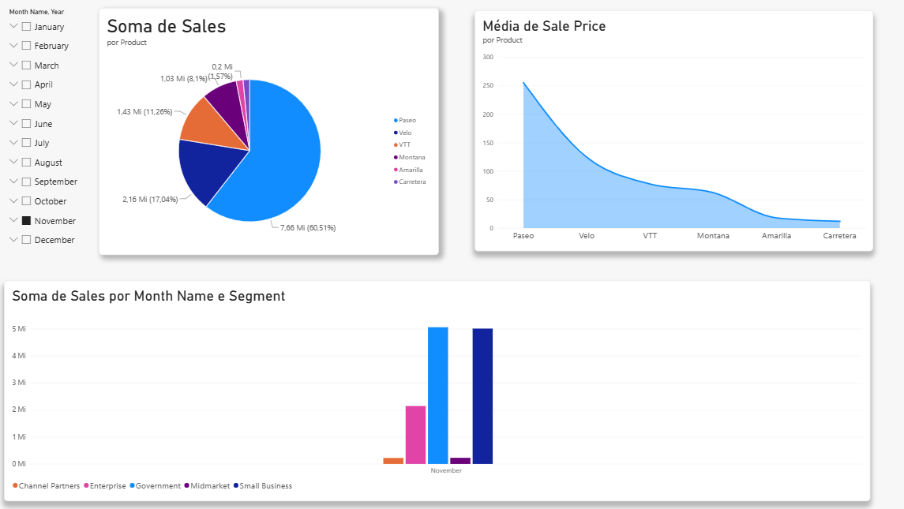
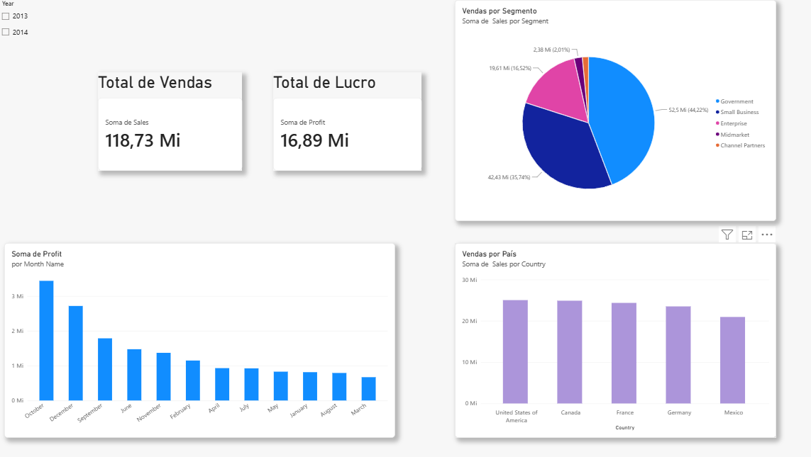
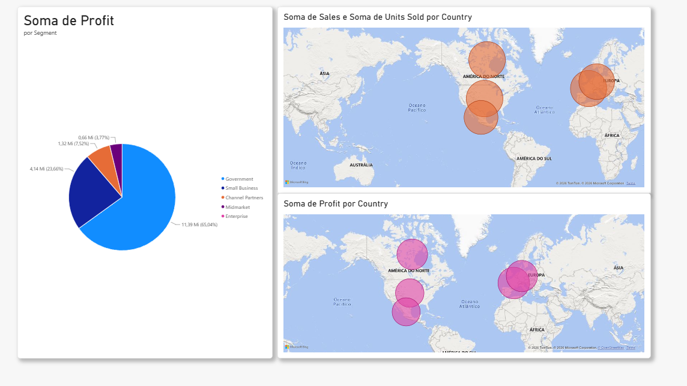

# 📊 Desafio de Projeto — Power BI

Projeto desenvolvido como parte da formação **Power BI Analyst da DIO**, com o objetivo de praticar a criação de relatórios e visualizações no Microsoft Power BI.

## 🎯 Objetivo

O desafio consiste em criar um relatório utilizando o conjunto de dados **Financial Sample**, reproduzindo páginas apresentadas durante o curso e desenvolvendo uma terceira página com novos visuais.

## 📈 Visuais desenvolvidos

O relatório contém análises como:

* Total de vendas
* Total de lucro
* Vendas por país
* Vendas por segmento
* Lucro por mês
* Filtro por ano
* Vendas e unidades vendidas por país
* Lucro por país
* Lucro por segmento

## 📸 Relatório

### Página 1

### Página 2

### Página 3

## 🛠️ Ferramentas utilizadas

* Microsoft Power BI Desktop
* Microsoft Excel
* GitHub

## 📂 Arquivos

Este repositório contém:

* Arquivo do projeto Power BI (`.pbix`)
* Imagens das páginas do relatório
* Dataset utilizado no projeto

## 🚀 Aprendizados

Durante o desenvolvimento deste projeto foram praticados conceitos como:

* Importação de dados
* Criação de cartões
* Gráficos de colunas
* Gráficos de pizza
* Mapas
* Segmentação de dados
* Organização de relatórios
* Configuração de títulos e visuais

## 📚 Referência

Projeto desenvolvido durante a formação **Power BI Analyst — DIO**.

Repositório de referência:

https://github.com/julianazanelatto/power_bi_analyst
